Use ansible to list out files & folders in /tmp directory.

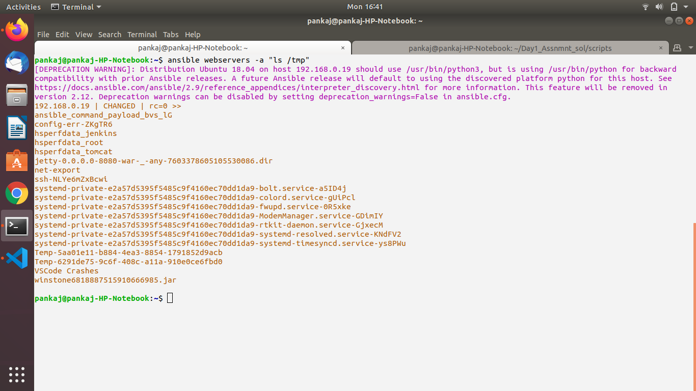

Install python on target machine using ansible.

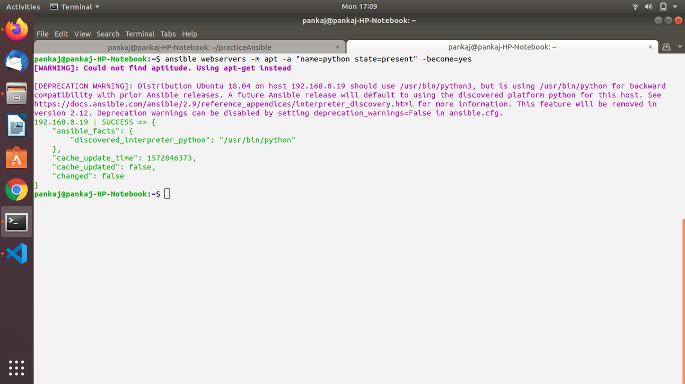

Use ansible to Create a user ninja

Use ansible to create a file /tmp/ninja.txt using ninja user.

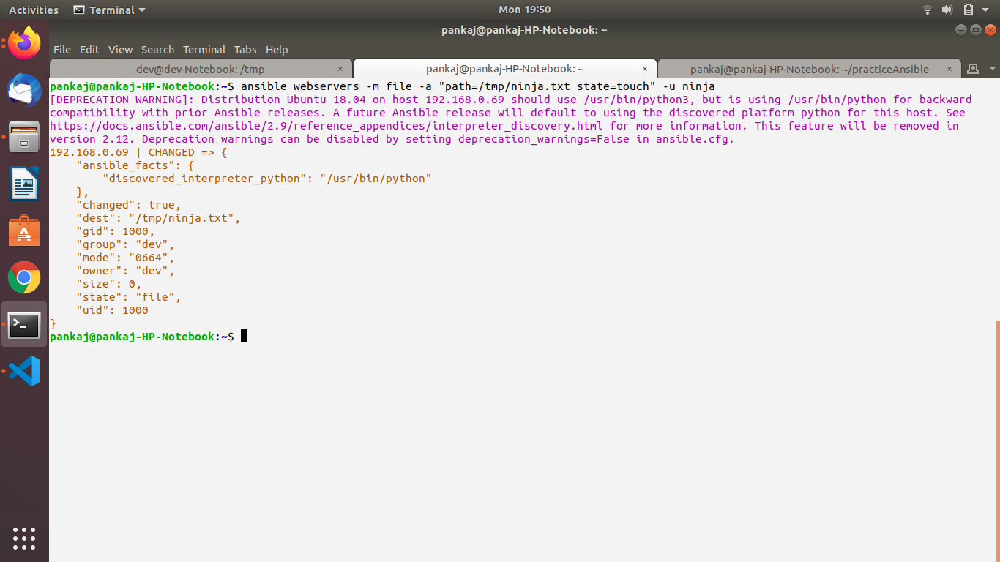

Change your default execution from command to ping.

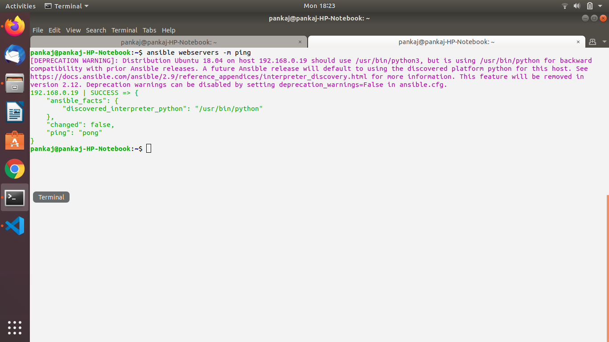

Fetch and display to STDOUT Ansible facts using the setup module.

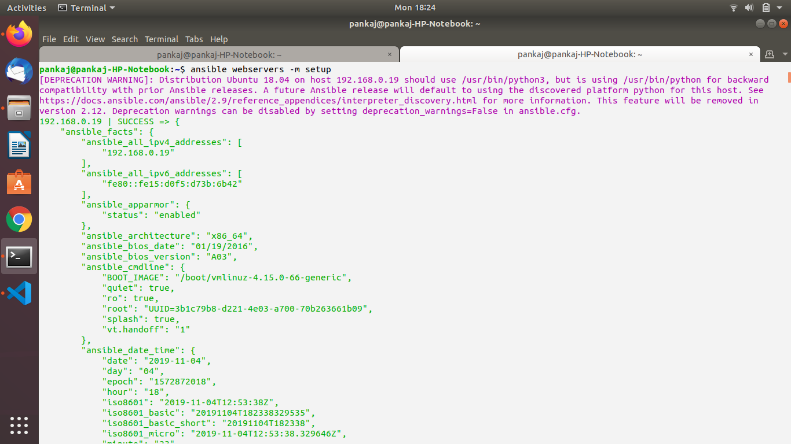

Fetch and display only the "virtual" subset of facts for each host.

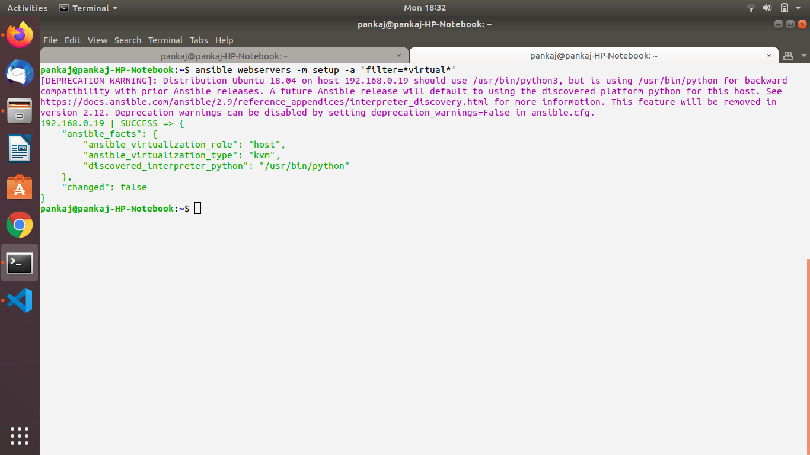

Fetch and display the value of fully qualified domain name (FQDN) of each host from their Ansible facts.

Good to Do

Setup Java8 on the hosts in the "App" group using the apt module.

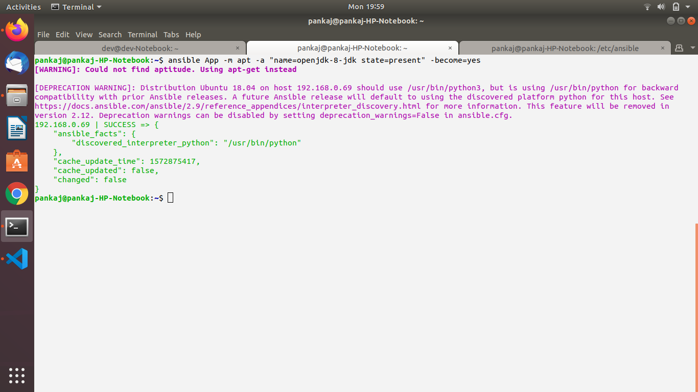

execute ansible adhoc commands on client machines (cannot be control machine) , to  create a file in /var/log/ninja_name on all the client nodes,

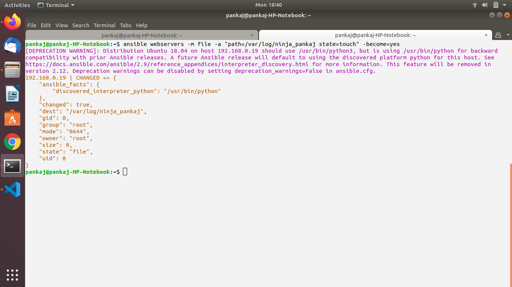

Install apache on Debian machine

Cross check apache isntalled or not from remote machine

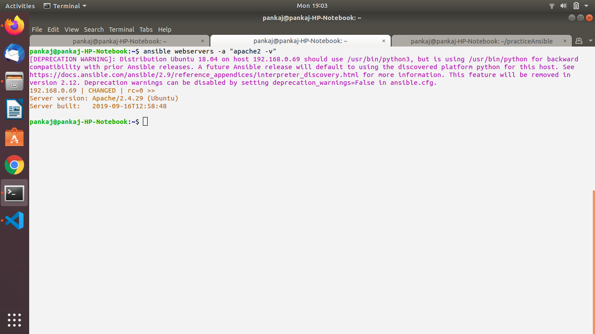

Apache runn  on 8082 port

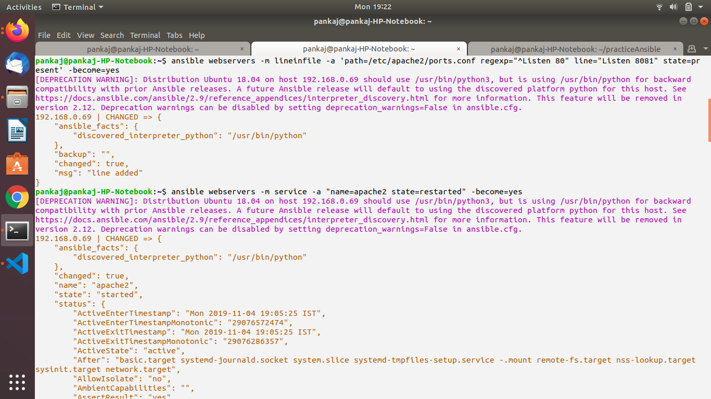

Create two virtual host

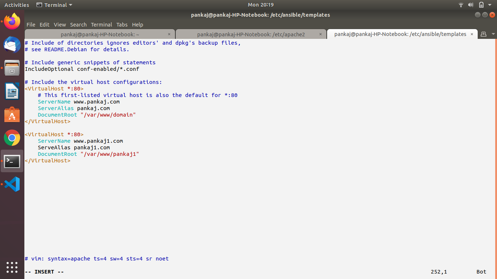

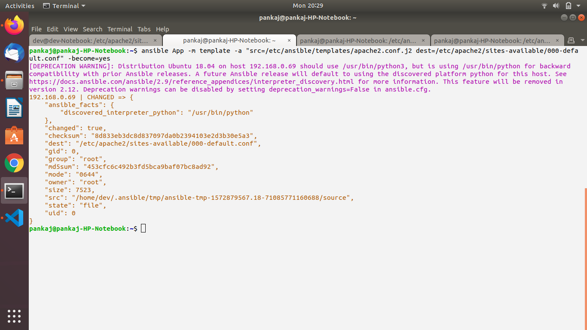

Restart apache from remote machine

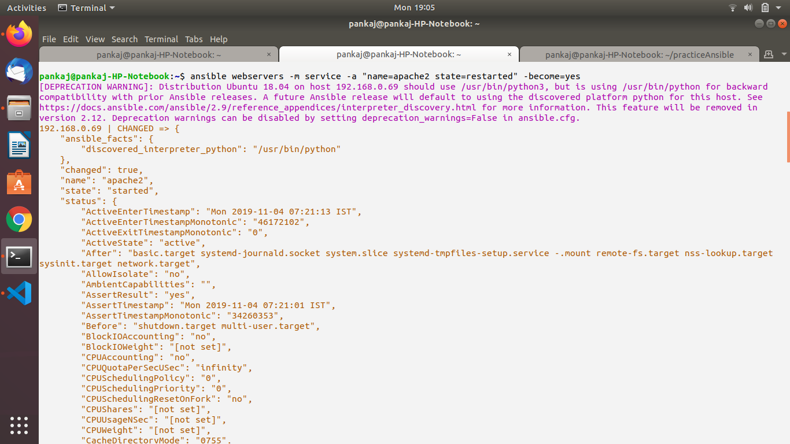