Must Do

Create a playbook that will:

Install apache

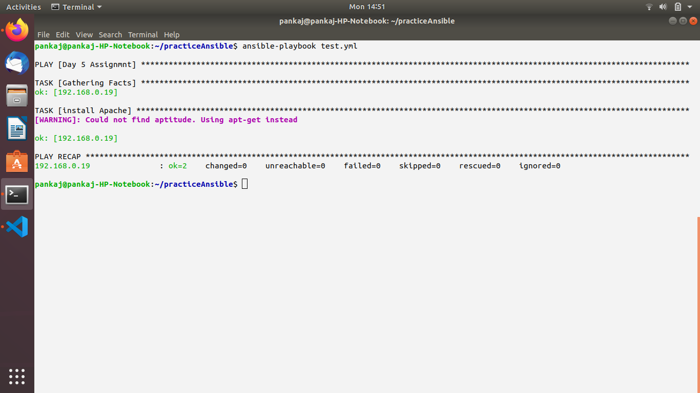

Create a apache home page with your name and System Information.

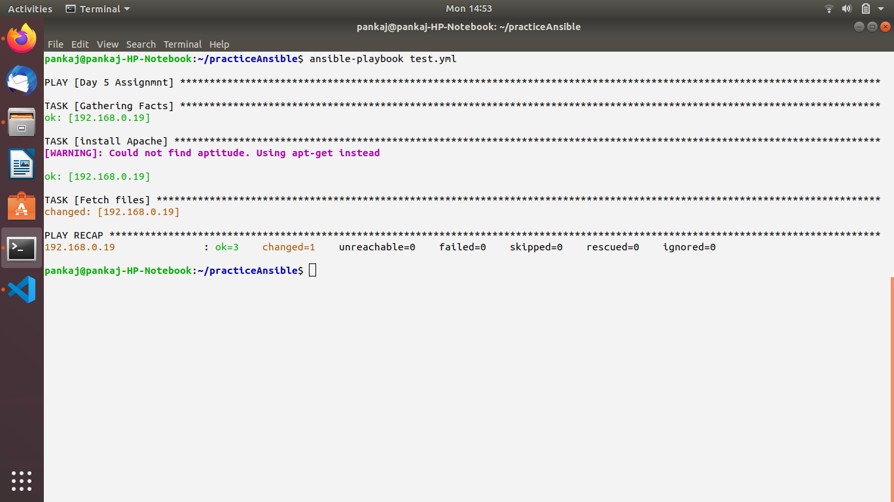

Reload apache

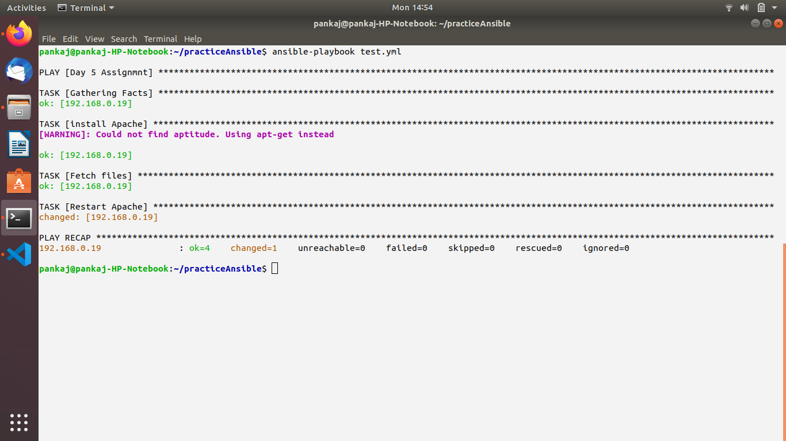

Update above playbook to reload apache only when content of home page get's updated.

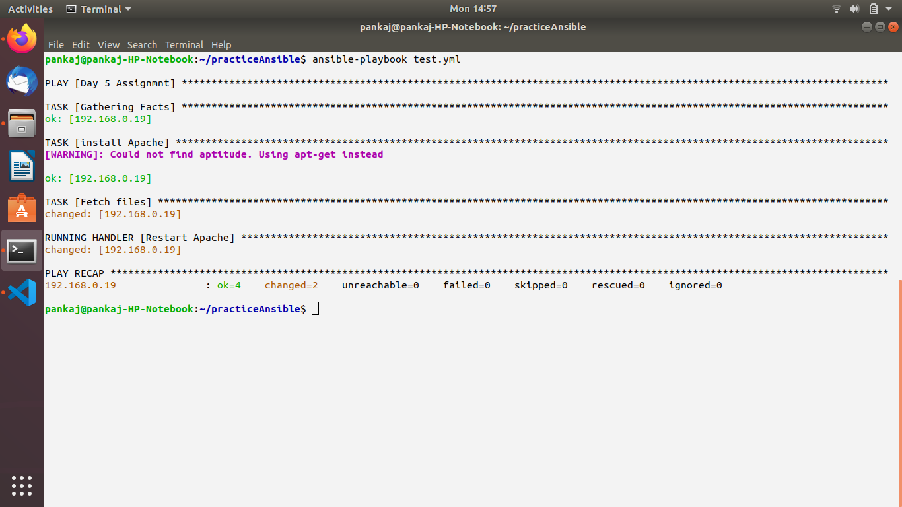

Update above playbook to install git, vim, ntp...

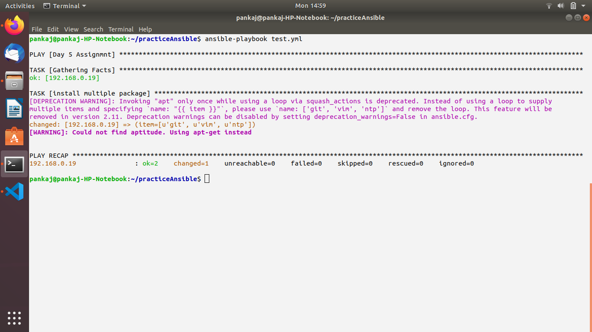

Update above playbook to create a user passed as parameter.

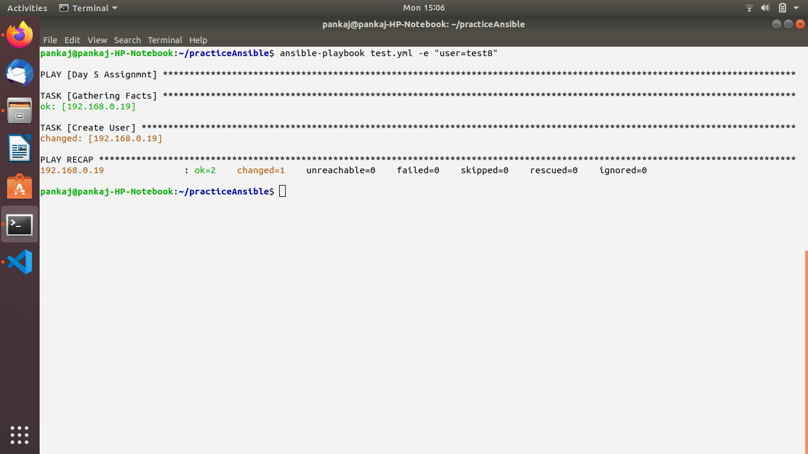

Update above playbook to add ninja & sensei user to opstree group else to devops group.

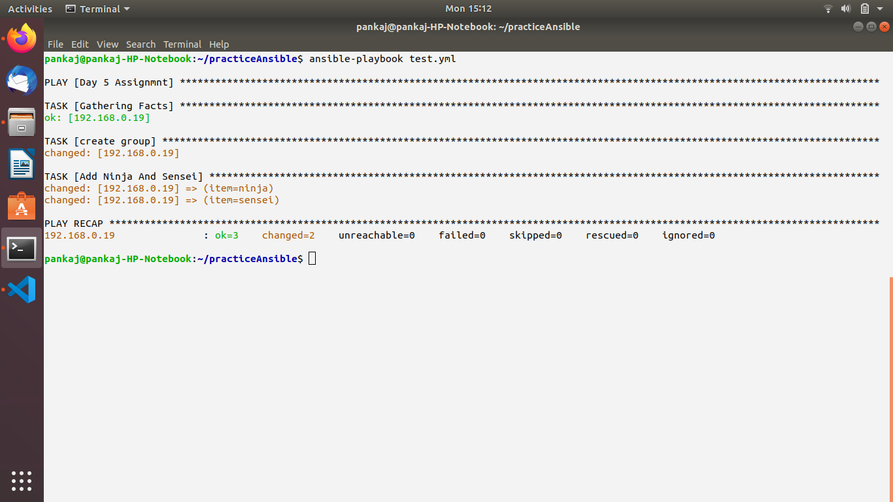

Update above playbook to prompt for user details to be created

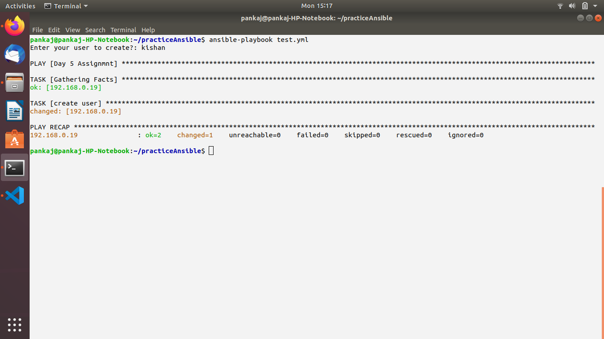

Update above playbook create all the users attending current training.

Update your playbook to externalise your tasks.

Good To Do

Create an ansible playbook on below condition.

The playbook should have two tasks, one is for adding user tom and the second task is to add group cat
Then try to run the complete playbook but it should execute the task for tom user creation.

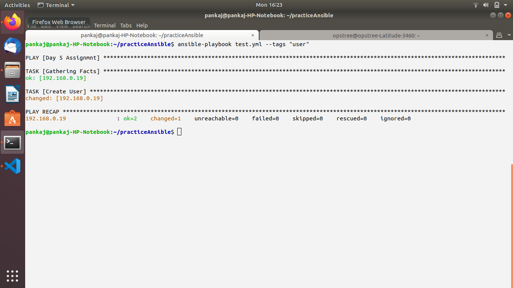

Create a task to install cron package only if I pass a variable install=yep.

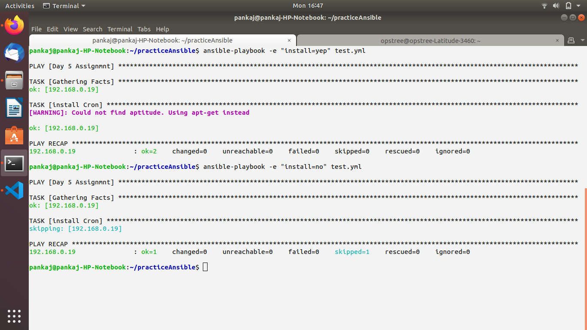

Create a task in which it will create a file in /tmp on below condition.
Let's assume region is a variable. So if the region value is east the file should contain central and if the region value is central then it should contain eastern.

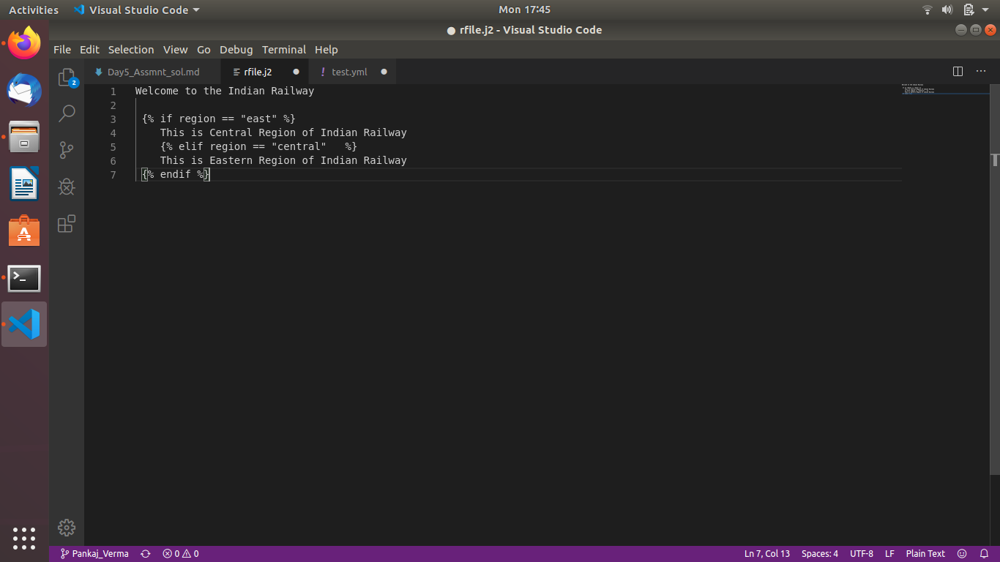

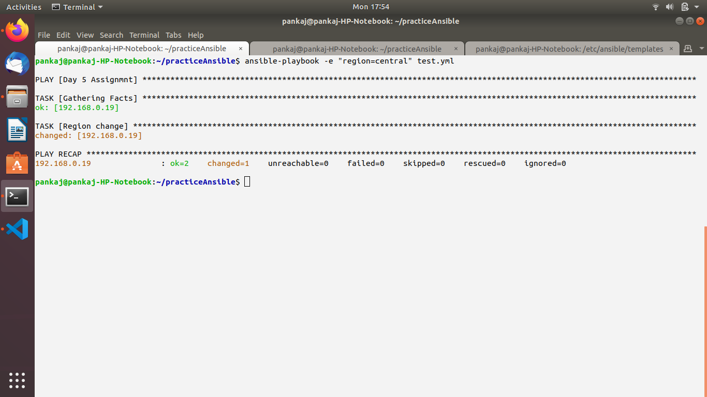

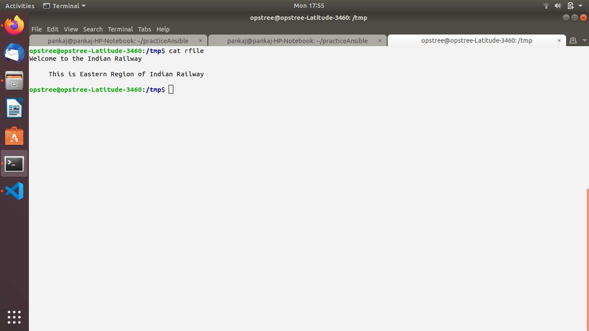

Create a playbook which will include user creation playbook.

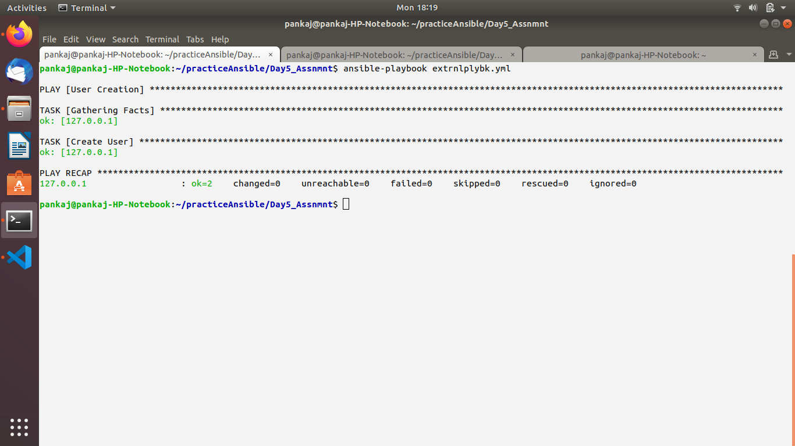