Must Do

Create an ansible role to install nginx on Ubuntu OS.

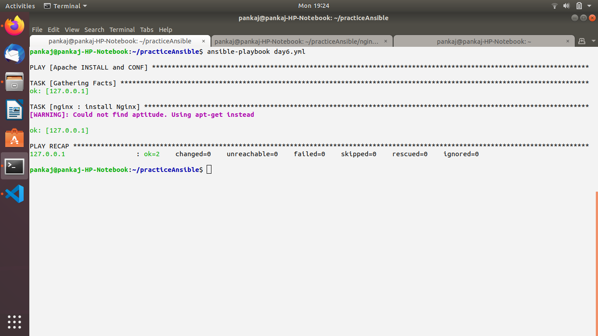

Update above role to fail if OS of target host system is not Ubuntu with message "OS not supported".

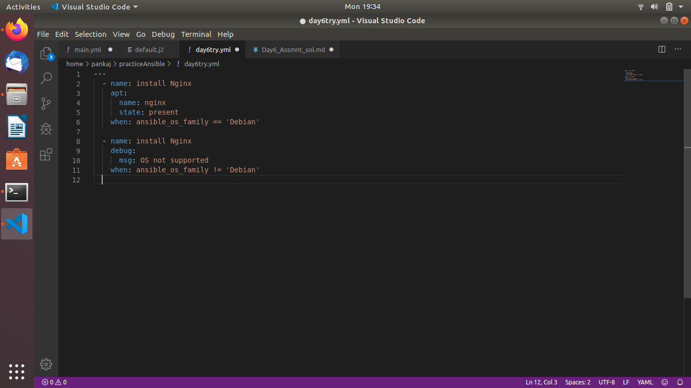

Update above role to change the home page of Nginx to show Welcome message "Hello from Opstree"

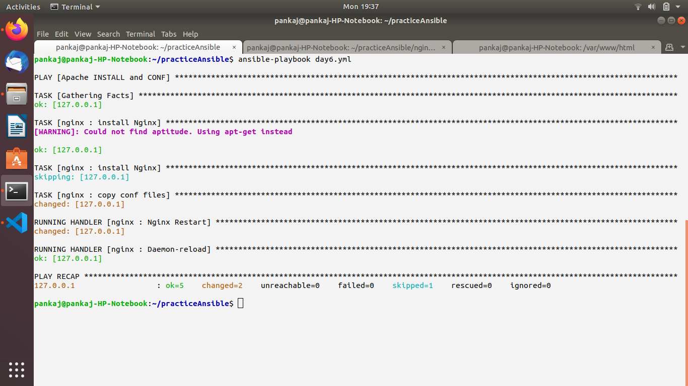

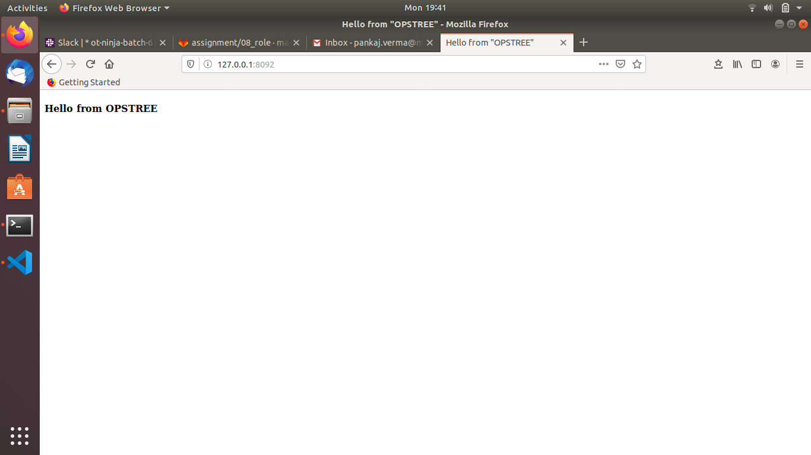

Update above role to take name of Welcomer as input i.e. "Hello from Sandeep", if not provided it should still print "Hello from Opstree".

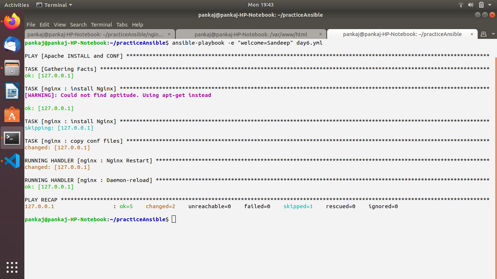

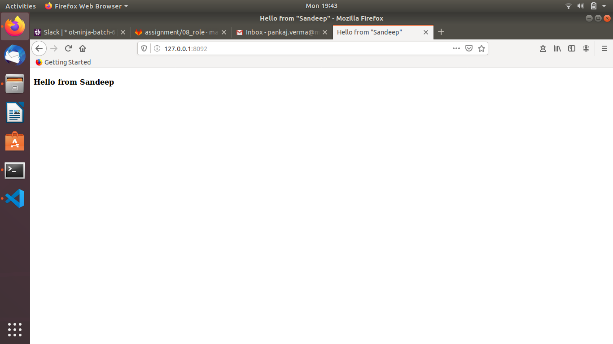

Update the welcome page of Nginx to display the System information along with Welcome message.
Hostname
IP addresses (public, private)
Operating System
RAM information (total, used, free)
Disk information (total,used, free)
Available Network Devices.

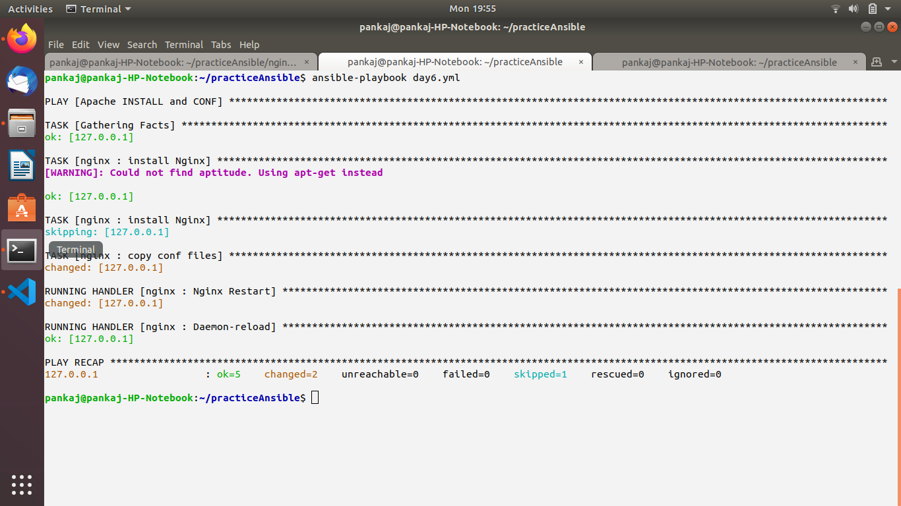

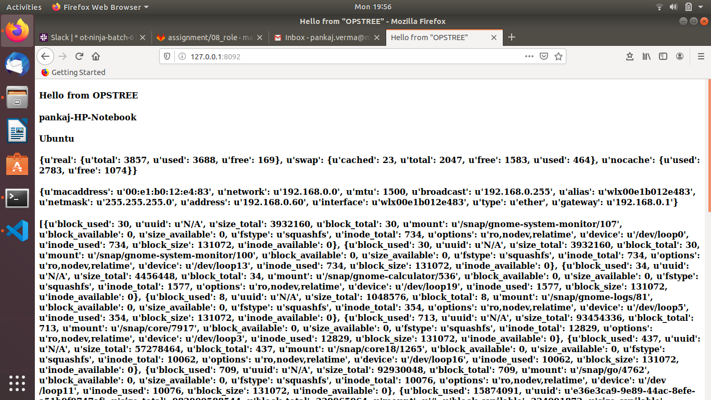

Update above role to take nginx listening port as input. Nginx should be reloaded only if Nginx port listening state changes.

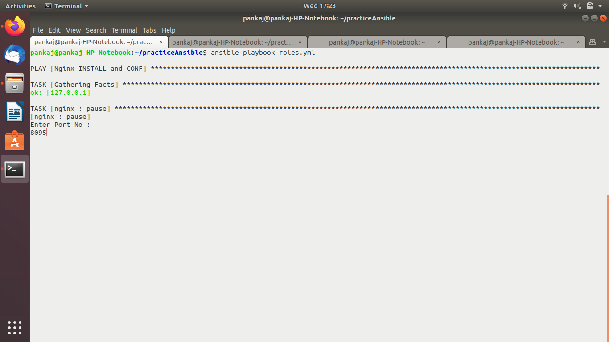

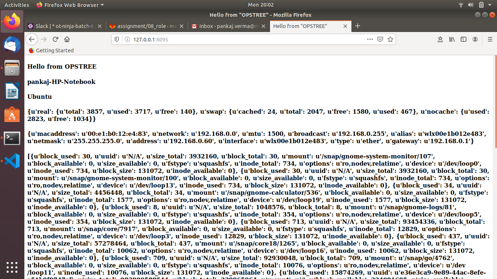

Optional

Create a public git repository by your name.
Add a file index.html in the repo, having a welcome message i.e. "Hello from Sandeep"

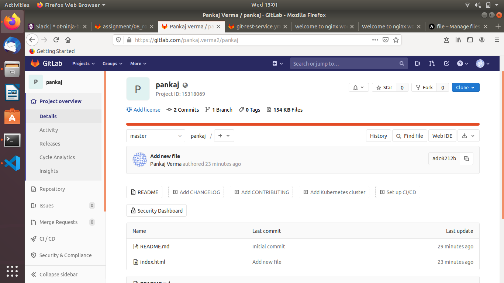

Update above role to remove default hosting
Create an ansible role to setup virtual hosting in target machine
The role will take "name" as parameter

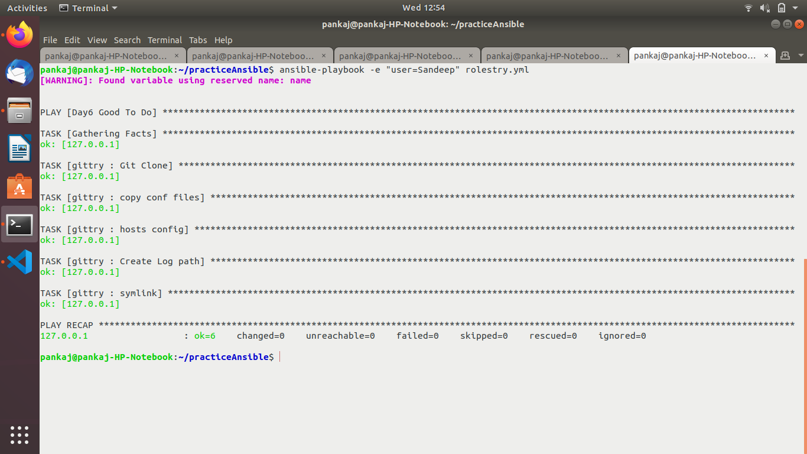

In turn role should perform below operation, if the name is "sandy"
Creates a file /etc/nginx/sites-enabled/sandy.conf should be symbolic link to corresponding entry to sites-available

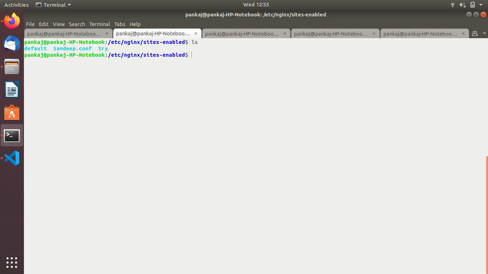

Creates a file /etc/nginx/sites-available/sandy.conf

The repository should be available at domain name "sandy.opstree.com" from your system.

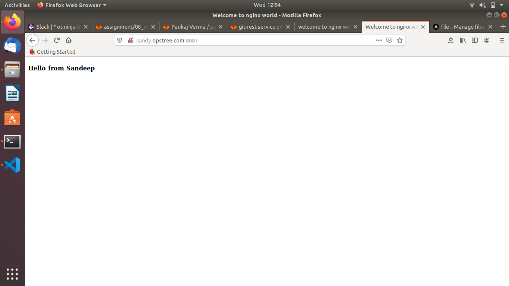

Access logs should be available at /var/log/nginx/sandy/access.log
Error logs should be available at /var/log/nginx/sandy/error.log

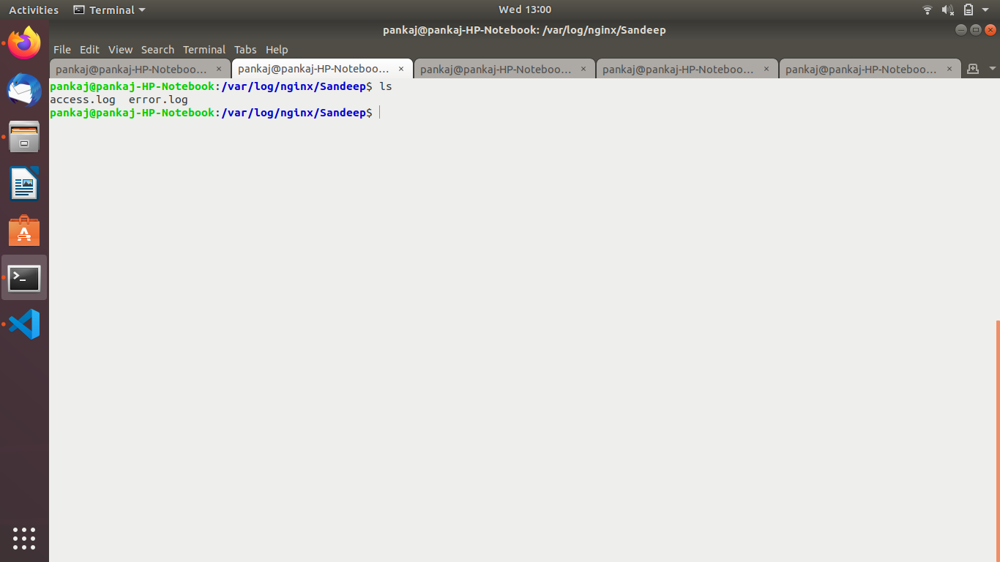