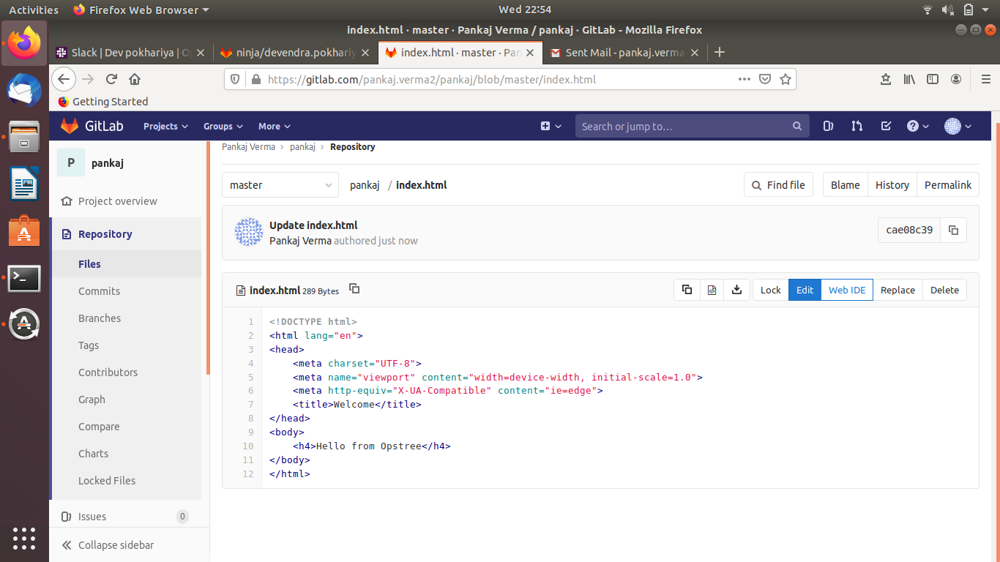
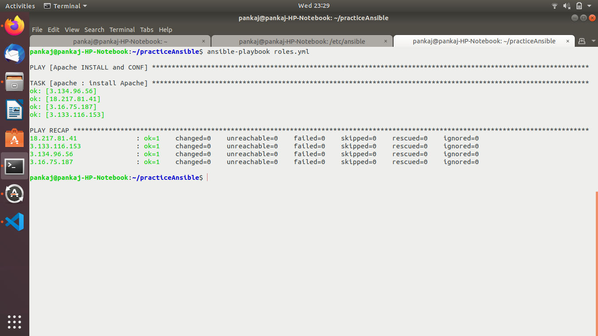
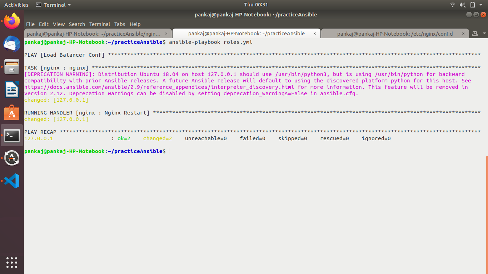
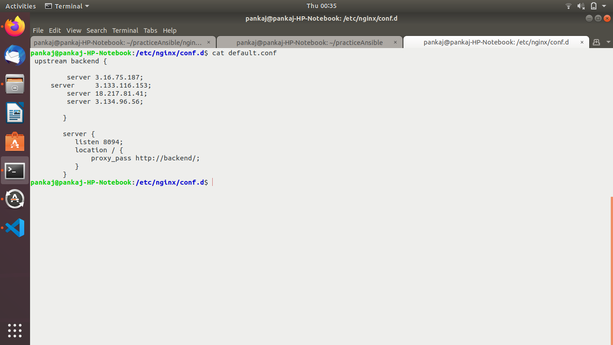
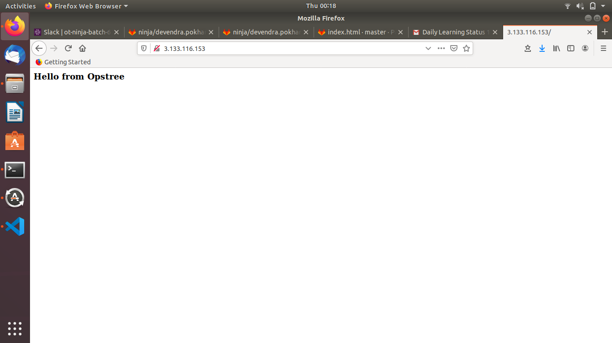
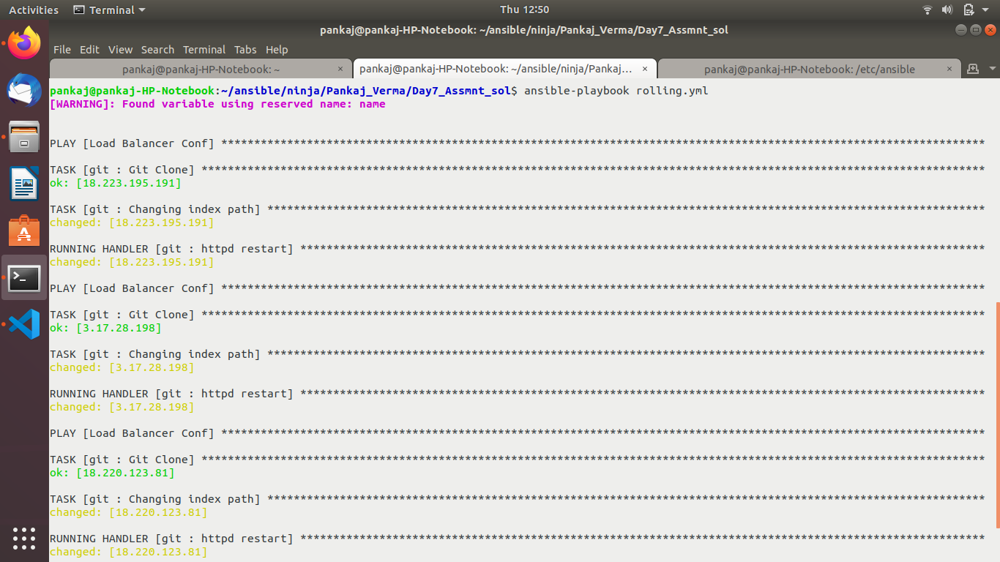
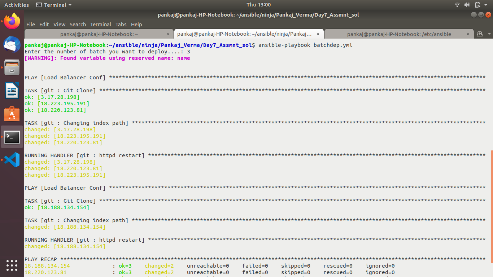
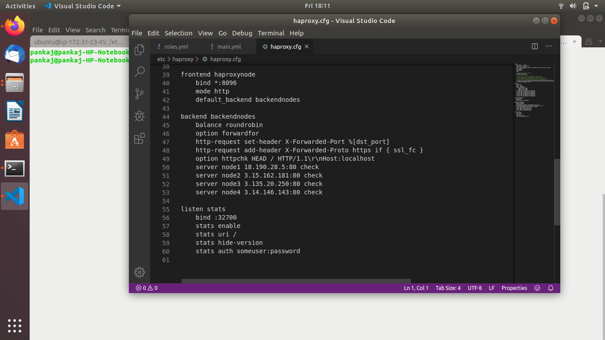
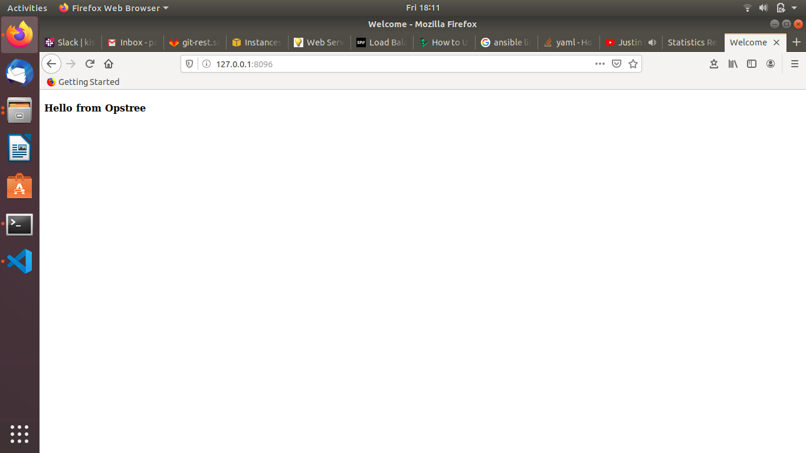

Must Do

Create below infrastructure

4 Web servers having Apache.
1 LoadBalancer server having Nginx.
Create a git repository having an index.html "Hello from Opstree".

Create an ansible role to setup apache.

Create an ansible role to setup Nginx as a load balancer on the 4 apache web servers

Create an ansible role to deploy the code from the git repository to all web servers in 
one single go.

Create an ansible role to deploy the code from the git repository to all web servers in rolling fashion.

Create an ansible role to deploy the code from the git repository to all web servers in a batches passed as parameter i.e if we pass 3 then first deployment will happen on 3 servers and then only on 1. The default value of batch will be 2 .

Optional

Replace Nginx with HAProxy as a load balancer.

Use Jenkins as an orchestrator.
Implement Blue/Green deployment in a similar fashion.