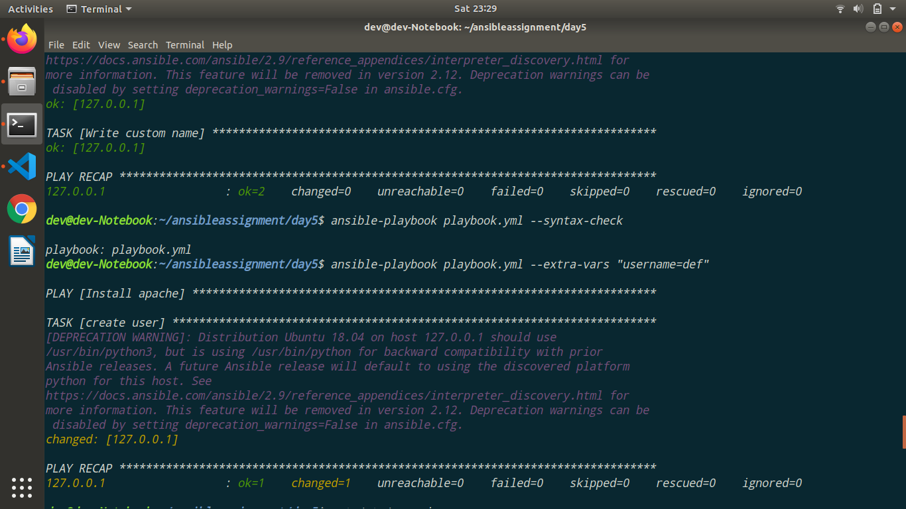
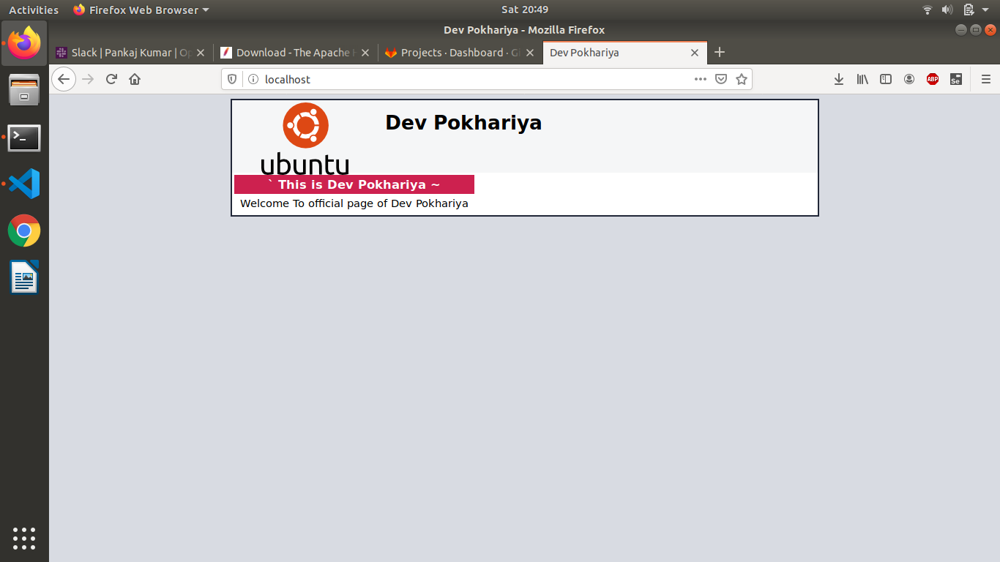
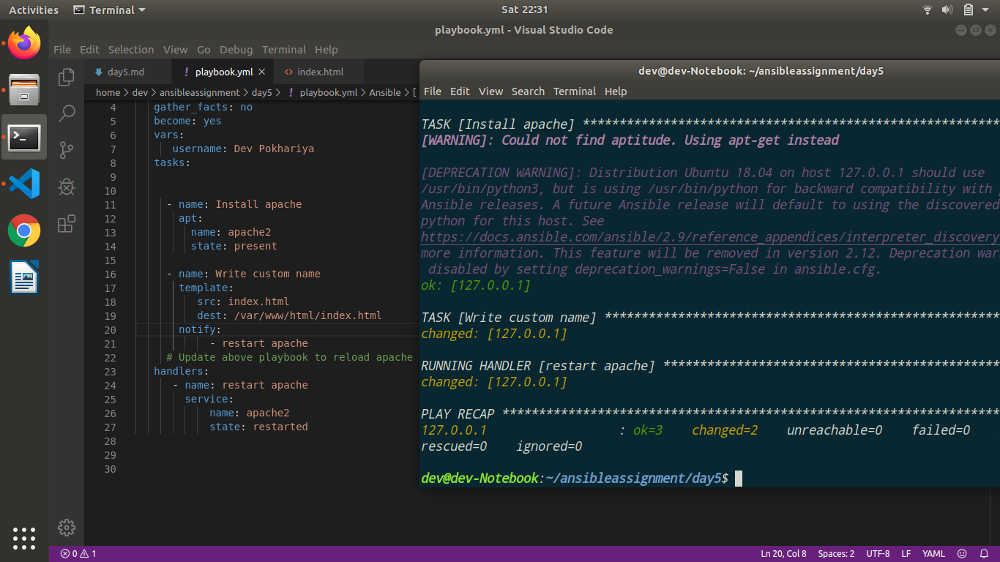
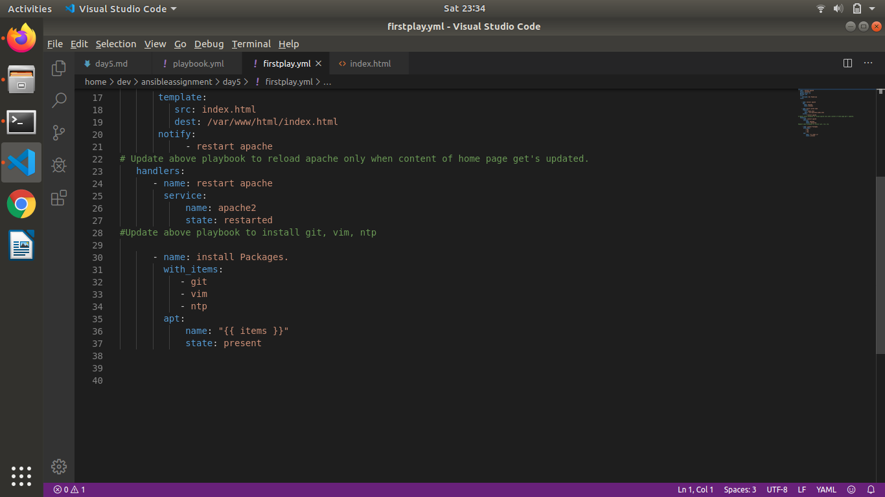
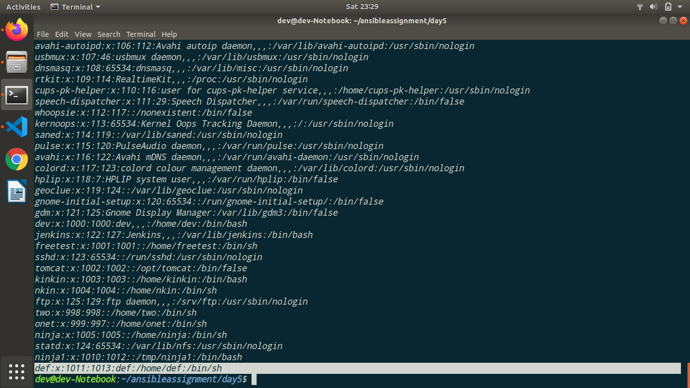
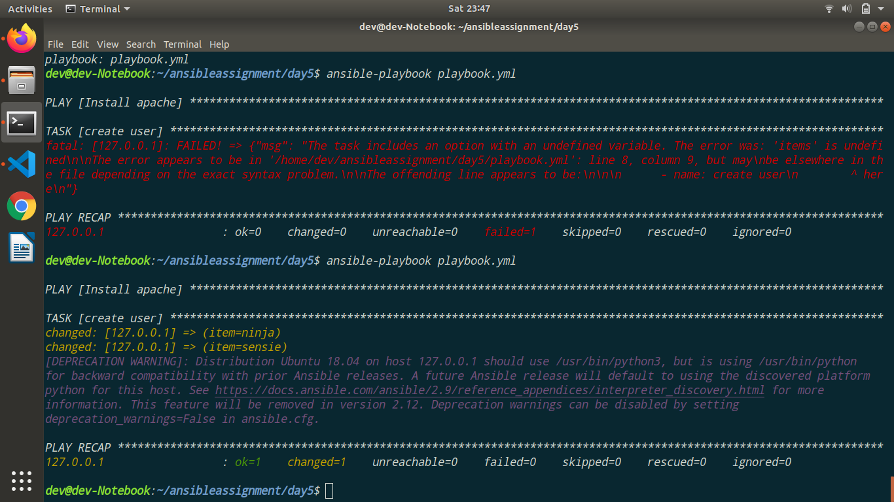
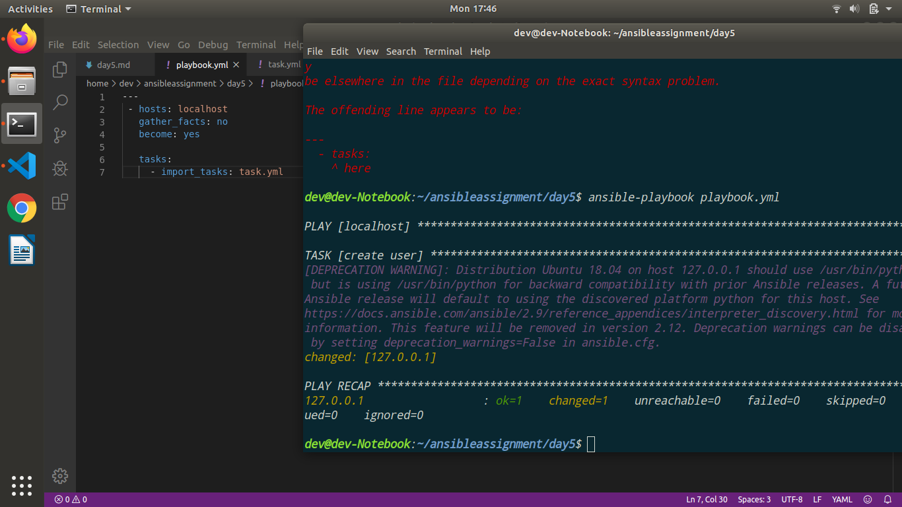
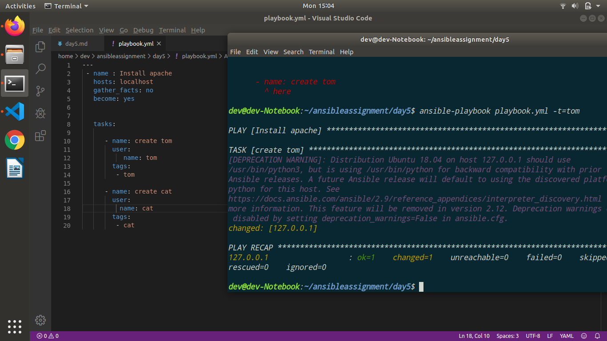
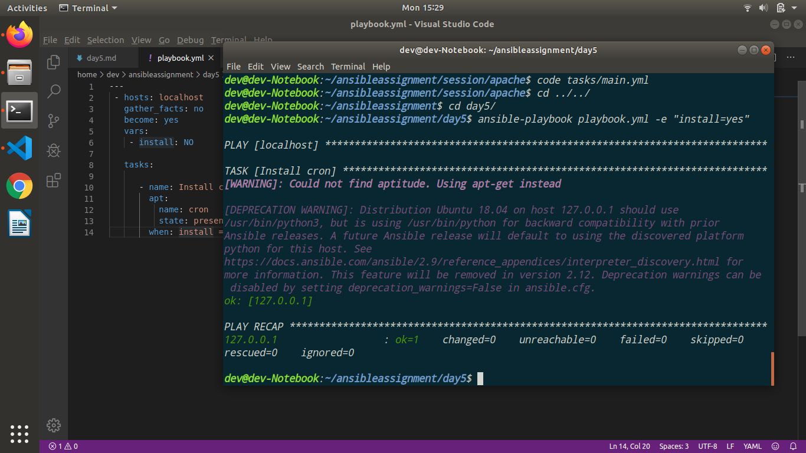

# Learning by Doing | Ansible Advance Playbook

## Introduction
In this section we will explore how use ansible playbook's advance concept

## References
- https://docs.ansible.com/ansible/latest/user_guide/playbooks.html

## Assignments
### Must Do
- Create a playbook that will:
  - Install apache

  
  
  - Create a apache home page with your name and System Information.
  - Reload apache

    

- Update above playbook to reload apache only when content of home page get's updated.

    

- Update above playbook to install git, vim, ntp...  

    

- Update above playbook to create a user passed as parameter.

    

    

- Update above playbook to add ninja & sensei user to opstree group else to devops group.

    

- Update above playbook to prompt for user details to be created

    ```
           ---
        - name : User Modification
          hosts: localhost
          gather_facts: no
          become: yes
          vars_prompt:

           - name: username
             prompt: "What is your username?"
             private: no      
          tasks:

             - name: create user
               user:
                  name: "{{ username }}"
           
    ```

    


- Update above playbook create all the users attending current training.
     ```
     ---
      - name : User Modification
        hosts: localhost
        gather_facts: no
        become: yes
     
           
        tasks:
           
           - name: create user
             user:
                name: "{{ item }}"
             with_items:
                - pankj
                - aru
                - kishn
                - ashutos 
                - prajl
                - bhupes
     ```
    

- Update your playbook to externalise your tasks.

        ``` 
    ---
     - hosts: localhost
       gather_facts: no
       become: yes
        
       tasks:
         - import_tasks: task.yml
        ```
    


### Good To Do
- Create an ansible playbook on below condition.

    - The playbook should have two tasks, one is for adding user `tom` and the second task is to add group `cat`
``` ---
 - name : Tom cat
   hosts: localhost
   gather_facts: no
   become: yes

      
   tasks:
      
      - name: create tom
        user:
           name: tom
        tags:
         - tom

      - name: create cat
        user:
          name: cat
        tags:
         - cat 

 ```


    - Then try to run the complete playbook but it should execute the task for `tom` user creation.




- Create a task to install **cron** package only if I pass a variable `install=yep`.

    ```
    ---
     - hosts: localhost
       gather_facts: no
       become: yes
       vars:
        - install: NO 

       tasks:

          - name: Install cron
            apt:
              name: cron
              state: present
            when: install == "yes"
    ```




- Create a task in which it will create a file in /tmp on below condition.
    ```
     ---
 - hosts: localhost
   gather_facts: no
   become: yes
    
   tasks:
     - import_tasks: task.yml
    ``` 
    ``` 
    ---
    - name: create user
      user: 
        name: guru
    
    ```


 


    - Let's assume **region** is a variable. So if the region value is east the file should contain central and if the region value is central then it should contain eastern.
    
    ``` 
    ---
 - hosts: localhost
   gather_facts: no
   become: yes
   vars:
    - region: east 
      
   tasks:
      
      - name: Region change
        template:
          src: place.j2
          dest: /tmp/place
    ```

 * your Jinja template
     ```
      
    This is Central
    
    This is Eastern
    
     ````
     
 ![images] (images/jen.png)


- Create a playbook which will include user creation playbook.

    ```
        ---
        - name: Include a play after another play
          import_playbook: task.yml


    ```
    