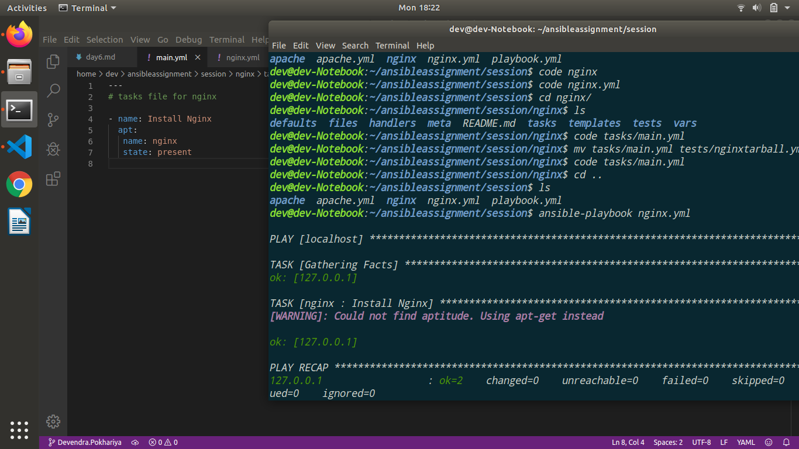
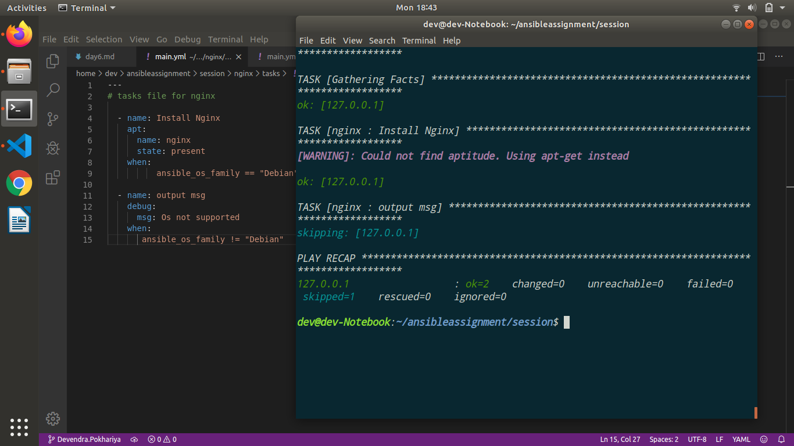
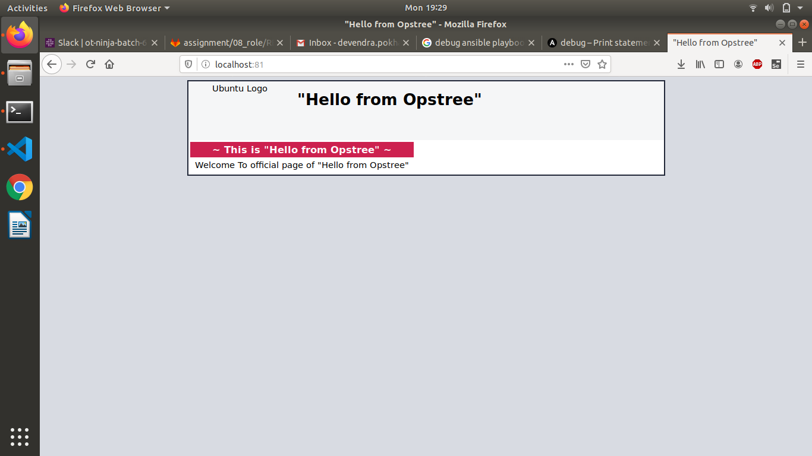
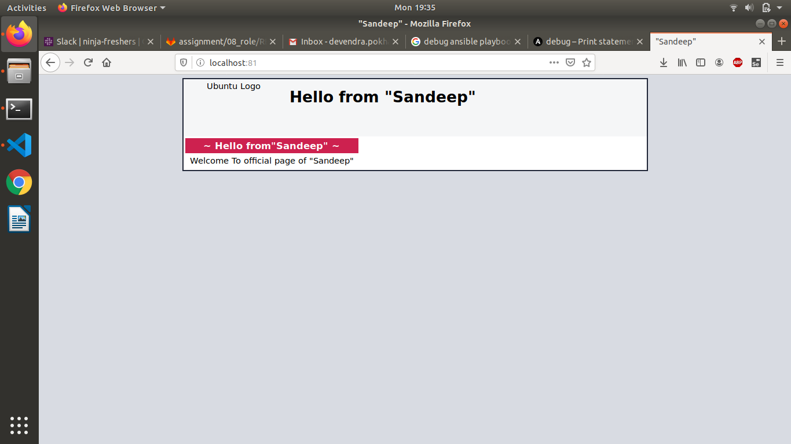
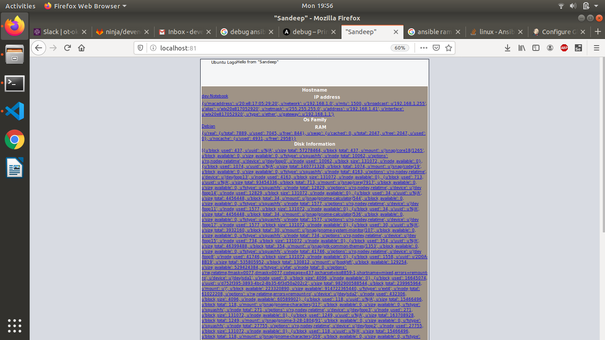

# Learning by Doing | Ansible Role

## Introduction
In this section we will learn how to create a role

## References
- https://docs.ansible.com/ansible/latest/user_guide/playbooks_reuse_roles.html

## Assignments
### Must Do
- Create an ansible role to install nginx on Ubuntu OS.
    
    ``` ansible-galaxy init nginx ```





- Update above role to fail if OS of target host system is not Ubuntu with message "OS not supported".

    ```
        ---
          # tasks file for nginx
    
      - name: Install Nginx
        apt:
          name: nginx
          state: present
        when: 
              ansible_os_family == "Debian"
    
      - name: output msg
        debug:
          msg: Os not supported
        when:
           ansible_os_family != "Debian"

    ```




- Update above role to change the home page of Nginx to show Welcome message "Hello from Opstree"

    ``` 
        ---
        # handlers file for nginx
         - name: restart nginx
           service:
              name: nginx
              state: restarted

         - name: deamon-reload
           systemd:
             daemon-reload: yes

    ```
    

    

- Update above role to take name of Welcomer as input i.e. "Hello from Sandeep", if not provided it should still print "Hello from Opstree".
    
    ```
            username: Opstree #default variable
    ```

    ```
            username: Sandeep # variable in vars/main.yml
    ```


- Update the welcome page of Nginx to display the System information along with Welcome message.
  * Hostname
  * IP addresses (public, private)
  * Operating System
  * RAM information (total, used, free)
  * Disk information (total,used, free)
  * Available Network Devices.




### Optional
- Create a public git repository by your name.

        ```
        ---
        # tasks file for nginx

          - name: Git Repo
        shell: git init /tmp/dev
      

        ```
- Update above role to take nginx listening port as input. Nginx should be reloaded only if Nginx port listening state changes.

- Add a file index.html in the repo, having a welcome message i.e. "Hello from Sandeep"
- Update above role to remove default hosting
- Create an ansible role to setup virtual hosting in target machine
  - The role will take "name" as parameter
  - In turn role should perform below operation, if the name is "sandy"
    - Creates a file /etc/nginx/sites-enabled/sandy.conf should be symbolic link to corresponding entry to sites-available
    - Creates a file /etc/nginx/sites-available/sandy.conf
    - The repository should be available at domain name "sandy.opstree.com" from your system.
    - Access logs should be available at /var/log/nginx/sandy/access.log
    - Error logs should be available at /var/log/nginx/sandy/error.log
