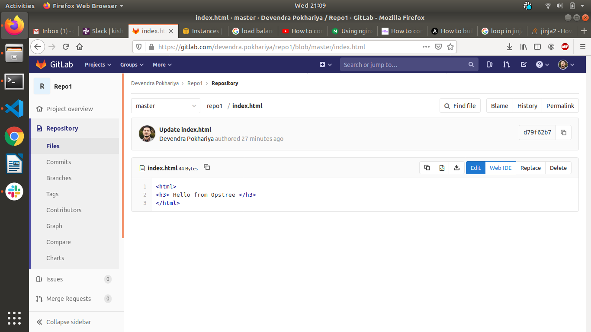
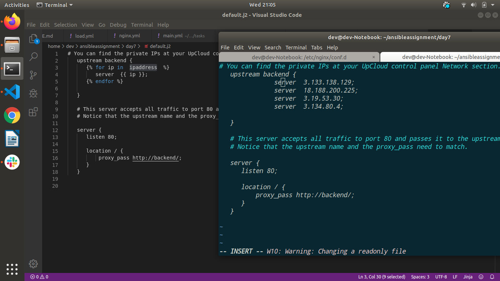
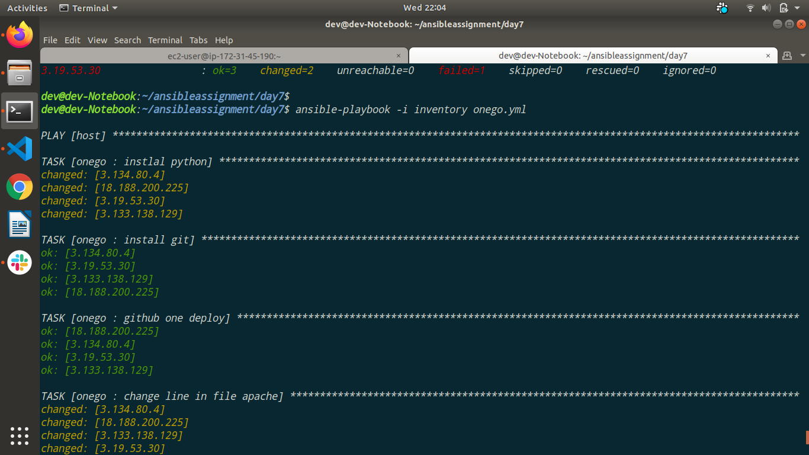
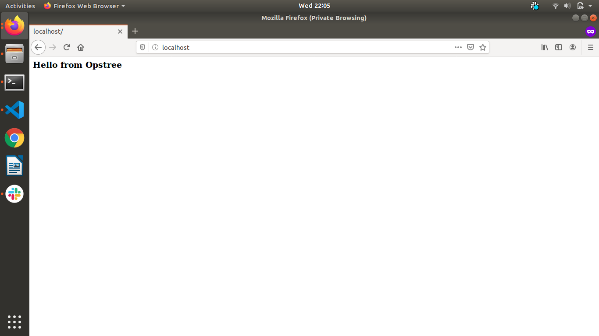

# Learning by Doing | Ansible Role

## Introduction
In this section we will learn how to use ansible for Deployment purpose

## References


## Assignments
### Must Do

- Create below infrastructure
  - 4 Web servers having Apache.
  - 1 LoadBalancer server having Nginx.


- Create a git repository having an index.html "Hello from Opstree".

    

- Create an ansible role to setup apache.

- Create an ansible role to setup Nginx as a load balancer on the 4 apache web servers


        nginx conf 
    ```
             upstream backend {
               
                  server  {{ ip }};
               

            }

            server {
               listen 80; 

               location / {
                   proxy_pass http://backend/;
               }
            }

    ```

   * Role for nginx

    ```
      ---
        - name: nginx
          template:
             src: default.j2
             dest: /etc/nginx/conf.d/default.conf
          notify:
             - restart nginx

    ```
    * Variable for ipaddress

    ``` ipaddress: [ 3.133.138.129, 18.188.200.225, 3.19.53.30, 3.134.80.4]```
        
        //Ipaddress are apache servers currently hosted in AWS 

    


- Create an ansible role to deploy the code from the git repository to all web servers in one single go.

    Main Task

    ``` 
    - name: instlal python
         raw: 'sudo yum install -y python3'
-        name: install git
         yum:
           name: git
           state: present

-        name: github one deploy
         git:
            repo: https://gitlab.com/devendra.pokhariya/repo1.git
            dest: /var/www/html/
            clone: yes
-        name: change line in file apache
         lineinfile:
            path: /etc/httpd/conf.d/welcome.conf
            regexp: '^\^Alias /var/www/html/repo1/index.html'
            line: 'Alias /.noindex.html /var/www/html/repo1/index.html'
            state: present
         notify: restart httpd

    ```


    Git repo

    

    Role output



    Website



- Create an ansible role to deploy the code from the git repository to all web servers in rolling fashion.
- Create an ansible role to deploy the code from the git repository to all web servers in a batches passed as parameter i.e if we pass 3 then first deployment will happen on 3 servers and then only on 1. The default value of batch will be 2 .


### Optional
- Replace Nginx with HAProxy as a load balancer.
- Use Jenkins as an orchestrator.
- Implement Blue/Green deployment in a similar fashion.
