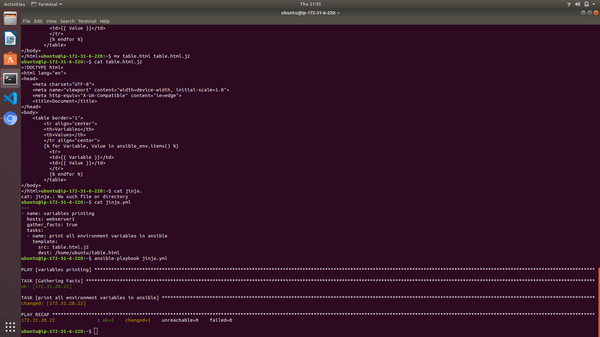
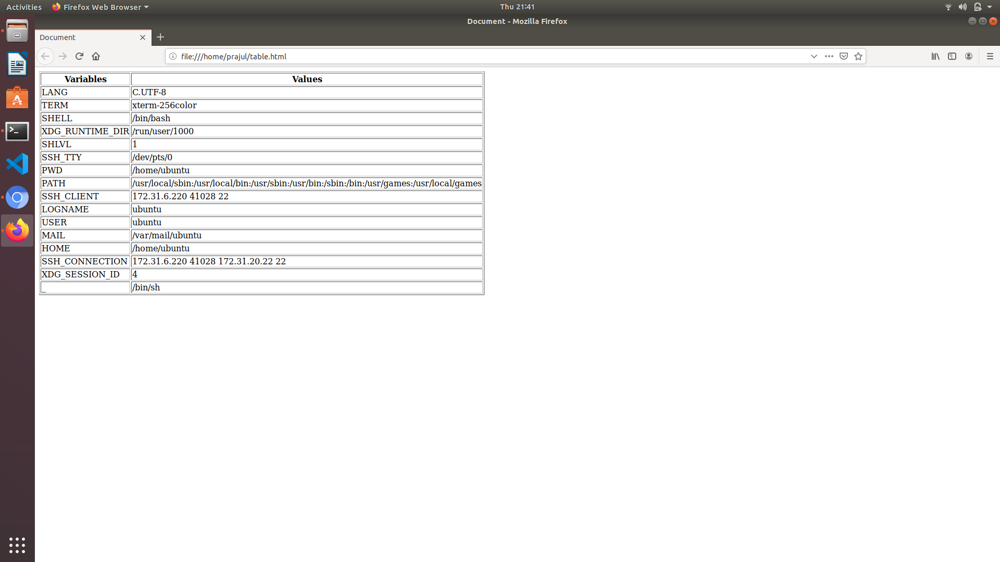

# Assignment Solution by Prajul Chauhan

## Must Do

- Create an ansible playbook to generate an HTML file in remote server that will list out all the available environment variables & the values.

|Variable|Value|
|-|-|
|TERM_PROGRAM|Apple_Terminal|
|TERM|xterm-256color|

