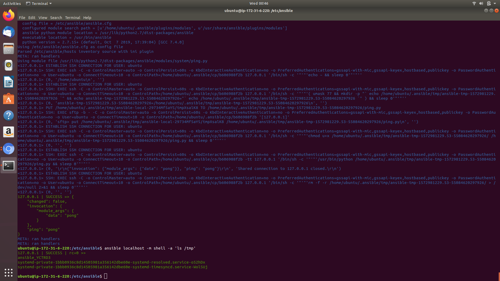
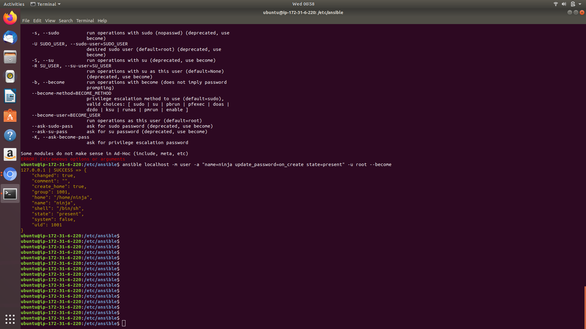
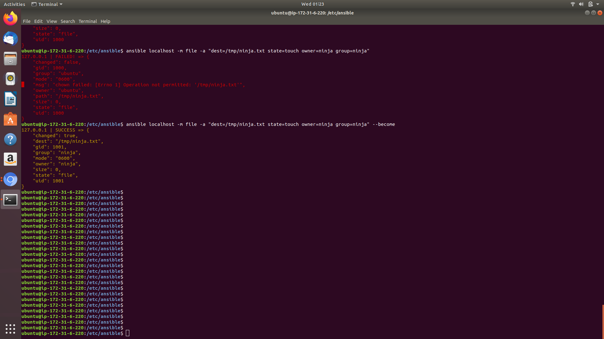
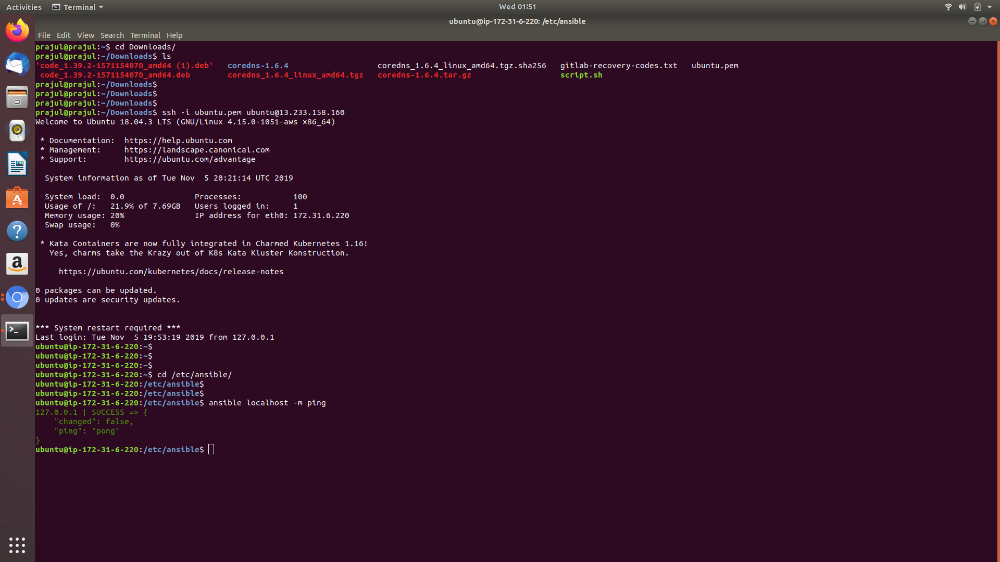
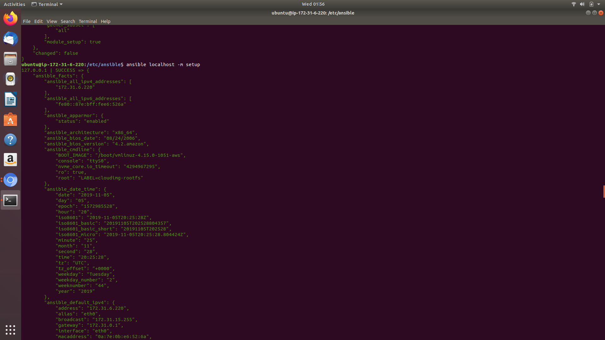
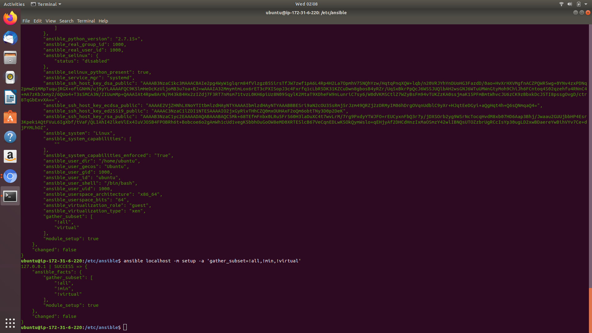
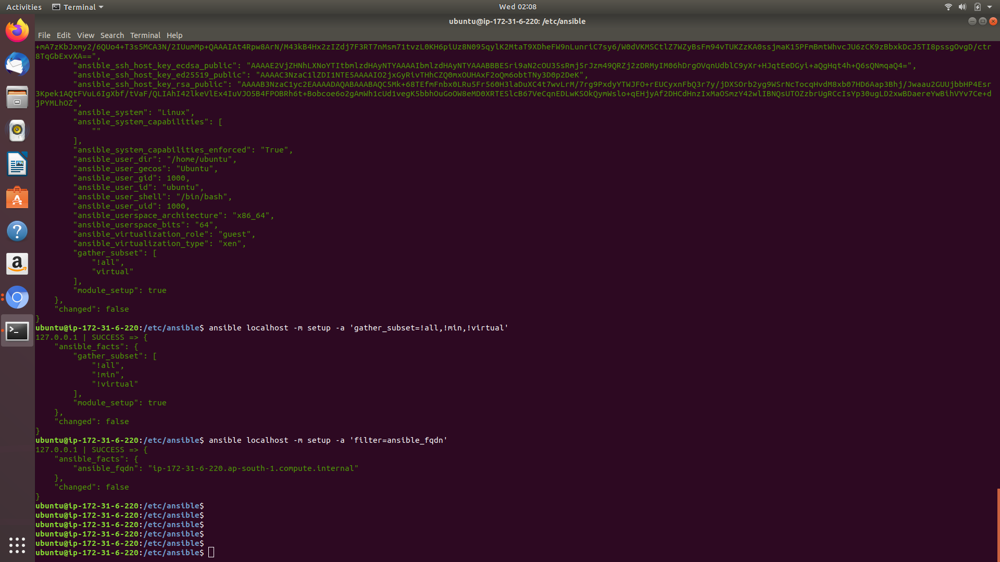
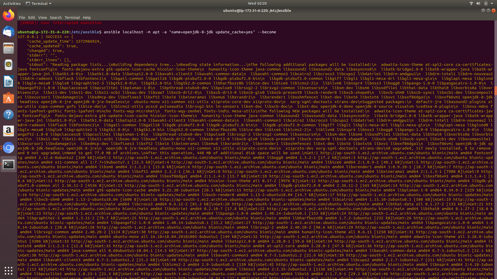

# Assignment Solution by Prajul Chauhan

## Must Do

* Use ansible to list out files & folders in */tmp* directory.

	ansible localhost -m shell -a 'ls /tmp'

	

* Use ansible to Create a *user ninja*

	ansible localhost -m user -a "name=ninja update_password=on_create state=present" -u root --become

	

* Use ansible to create a file */tmp/ninja.txt* using ninja user.

	ansible localhost -m file -a "dest=/tmp/ninja.txt state=touch owner=ninja group=ninja" --become

	

* Change your default execution from *command* to *ping*.

	ansible localhost -m ping

	

* Fetch and display to STDOUT Ansible facts using the `setup` module.

	ansible localhost -m setup

	

* Fetch and display only the "virtual" subset of facts for each host.

	ansible localhost -m setup -a "gather_subset=!all,!min,!virtual"

	

* Fetch and display the value of fully qualified domain name (FQDN) of each host from their Ansible facts.

	ansible localhost -m setup -a "filter=ansible_fqdn"

	

### Good to Do

* Setup Java8 on the hosts in the "App" group using the apt module.

	ansible localhost -m apt -a "name=openjdk-8-jdk update_cache=yes" --become

	

* execute ansible adhoc commands on client machines (cannot be control machine) , to  create a file in /var/log/ninja name on all the client nodes,

	ansible all -m file -a "dest=/var/log/ninja state=touch" --become

* Install apache on Debian machine

	ansible localhost -m apt -a "name=apache state=present" --become

* Apache run on 8082 port

	ansible localhost -m firewalld -a "name=apache port=8082" --become

* Restart apache from remote machine

	ansible localhost -m service -a "name=httpd state=restarted"

