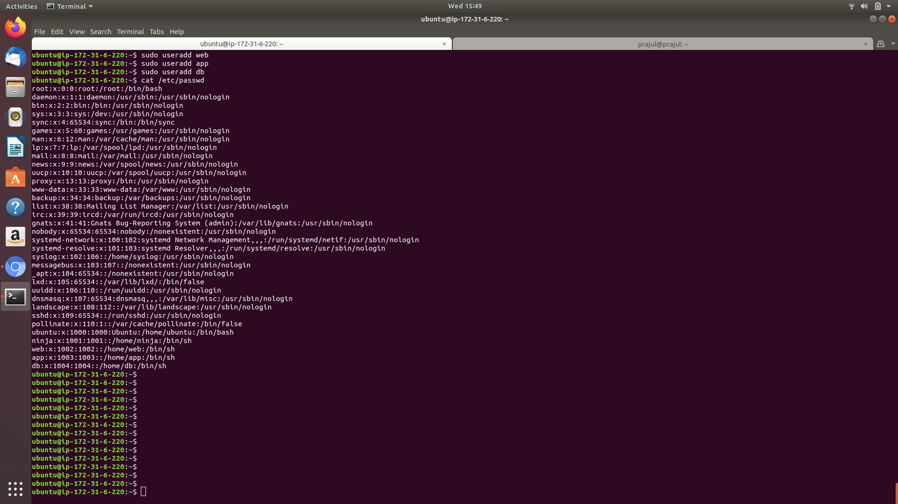
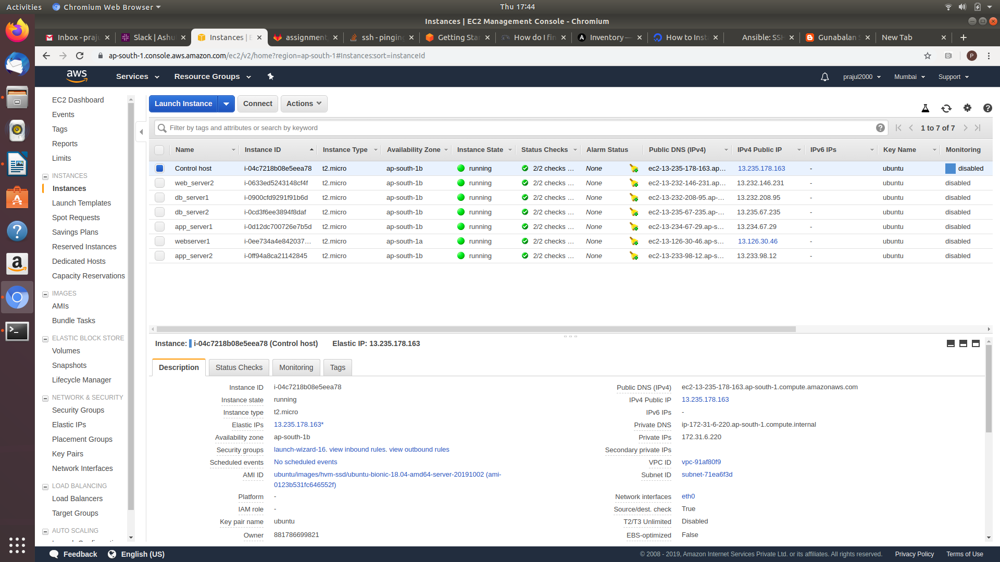
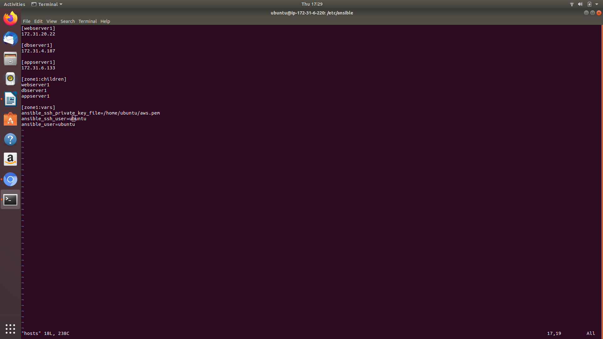
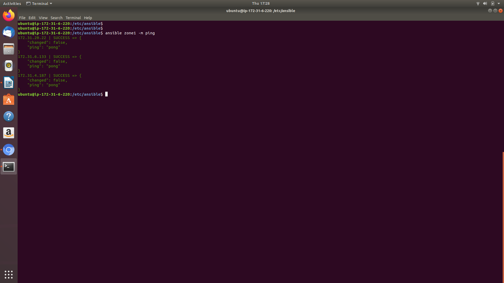
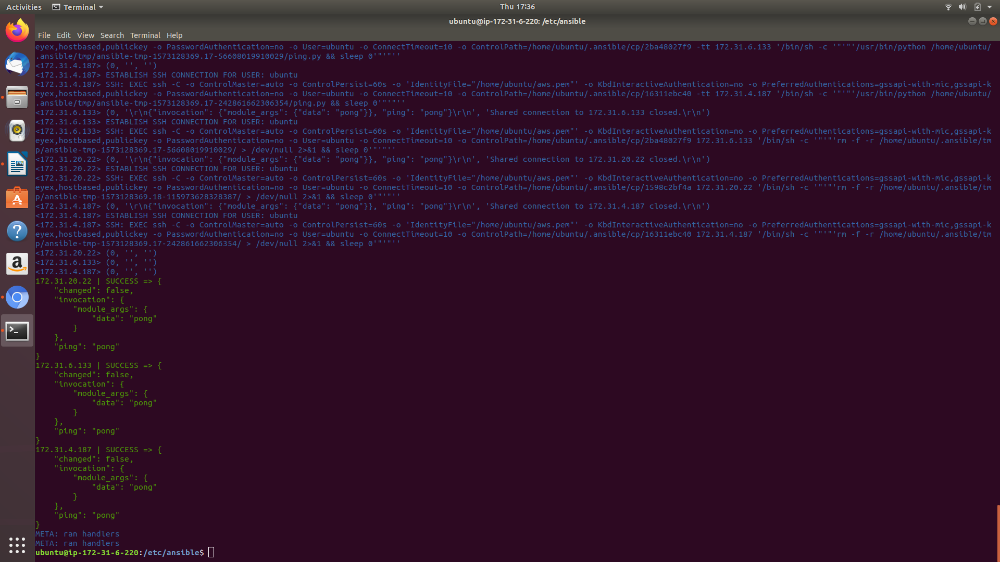

# Assignment SOlution by Prajul Chauhan

## Prerequisites
For this assignment you have to simulate an infrastructure where you have below simulated machines, it can be one machine as well.
- Three users should be present on your machine **web**, **app** and **db**.
- Place **ubuntu** key-pair in **web** home directory and user should be able to do password less login.
- Generate key pair for **app** user and it should be using its key for doing ssh.
- Same as well **db** there should be a seperate key pair for doing ssh.

	
	

## Assignments
For this assignment you have to simulate an infrastructure where you have below simulated machines, it can be one machine as well
* web server 1 in zone A, reachable by **web** user from your machine
* web server 2 in zone B, reachable by **web** user from your machine
* app server 1 in zone A, reachable by **app** user from your machine, using **app.pem** key.
* app server 2 in zone B, reachable by **app** user from your machine, using **app.pem** key
* db server 1 in zone A, reachable by **db** user from your machine, using **db.pem** key and ssh port would be **2022** 
* db server 2 in zone B, reachable by **db** user from your machine, using **db.pem** key and ssh port would be **2022** 

	

	

## Must Do
* Try to reach out all web servers using ansible ping command
* Try to reach out all app servers using ansible ping command
* Try to reach out all db servers using ansible ping command
* Try to reach out all zone A servers using ansible ping command
* Try to reach out all Zone B servers using ansible ping command
* Submit your inventory file as solution

	
	

	

### Good to Do
* Do the solution for same problem statement using yaml file.

	webserver:
        hosts:
          172.31.34.245
        vars:
          ansible_user:web
     	appserver:
         hosts:
           172.31.42.34
         vars:
           ansible_user:app
           ansible_ssh_private_key:/home/ansadmin/.ssh/id_rsa.pub
      	dbserver:
         hosts:
           172.31.16.109
         vars:
           ansible_user:db
           ansible_ssh_private_key:/home/ansadmin/.ssh/id_rsa.pub
           ansible_port:2022
       	zone1:
          children:
            webserver
            appserver
            dbserver
